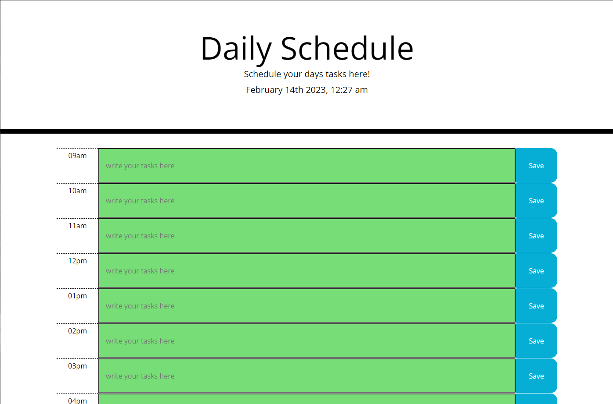

## Dailyschedule
### Description
Need help scheduling for your day? Look no further, though this will only help you do one day at a time, you can map out your day by the hour! This app uses Moment.js for the time, and jquery/js to generate input boxes that you can use to schedule your day and even update your activities. It also uses Moment.js to change the color of the hours depending on what hours are coming up, what hour it is, and what hours have passed.
### Links
[deployed-page](https://ikomeda.github.io/dailyschedule/)
### Screenshot
